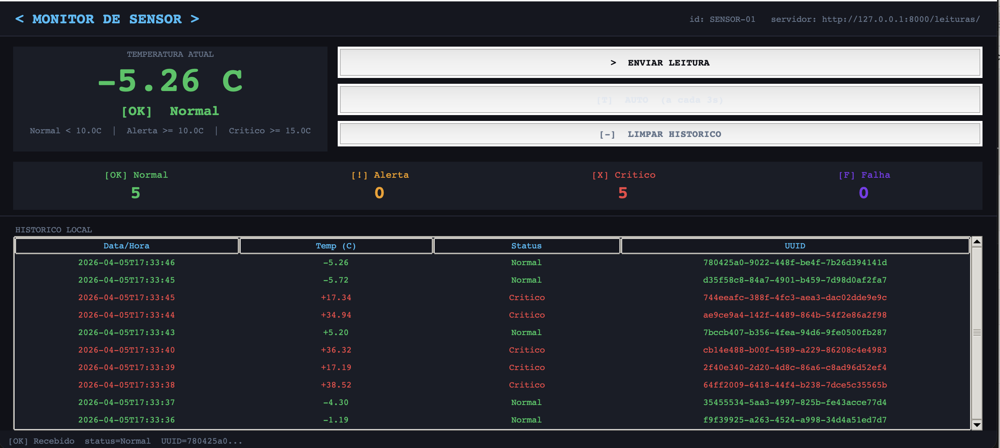
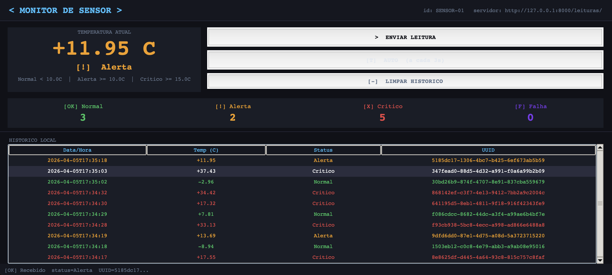
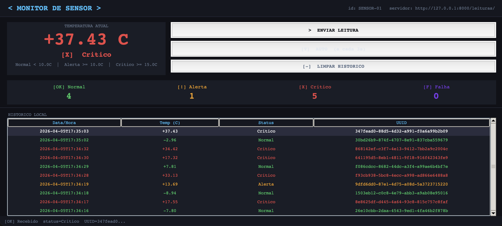
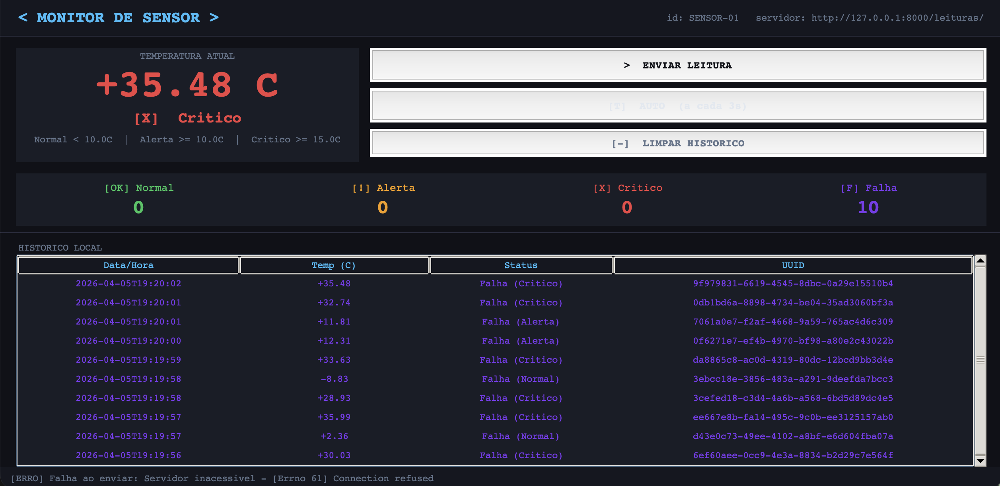

# Servidor - Sistema de Monitoramento de Temperatura 📊

Camada de servidor do sistema distribuído de monitoramento de sensores.  
API REST assíncrona em **FastAPI**, com persistência em **SQLite** via SQLAlchemy assíncrono.

---

## Estrutura de arquivos

```
Trabalho-3/
├── main.py                          # Ponto de entrada - execute este arquivo
├── pyproject.toml                   # Dependências do projeto
└── src/
    ├── api.py                       # Configuração do FastAPI e registro de rotas
    ├── server.py                    # Inicialização do banco e do servidor
    ├── core/
    │   ├── settings.py              # Configurações da aplicação (URL do banco)
    │   └── models.py                # Base declarativa do SQLAlchemy
    ├── db/
    │   ├── bd.py                    # Engine assíncrona e sessão do banco
    │   └── db.sqlite3               # Arquivo do banco de dados SQLite
    ├── shared/
    │   └── idgenerate.py            # Utilitário para geração de UUIDs
    └── features/
        └── temperature/
            ├── temp_model.py        # Modelo ORM da tabela de leituras
            ├── temp_schema.py       # Schemas Pydantic (entrada e saída)
            ├── temp_repository.py   # Acesso ao banco de dados
            ├── temp_service.py      # Regras de negócio
            └── temp_router.py       # Rotas da API
```

---

## Arquitetura em camadas

```
Cliente HTTP
     │
     ▼
 temp_router.py      ← recebe a requisição HTTP
     │
     ▼
 temp_service.py     ← aplica regras de negócio
     │
     ▼
 temp_repository.py  ← acessa o banco de dados
     │
     ▼
  SQLite (db.sqlite3)
```

---

## Pré-requisitos

- Python 3.13 ou superior
- Dependências listadas no `pyproject.toml`:

| Pacote | Descrição |
|---|---|
| `fastapi` | Framework web assíncrono |
| `uvicorn` | Servidor ASGI |
| `sqlalchemy` | ORM assíncrono |
| `aiosqlite` | Driver SQLite assíncrono |
| `pydantic-settings` | Gerenciamento de configurações |
| `greenlet` | Dependência do SQLAlchemy assíncrono |

---

## Instalação e execução

Se já tiver os pacotes listados nos pré-requisitos instalados, basta rodar:

```bash
python3 main.py
```

Caso contrário, instale as dependências primeiro:

```bash
# 1. Entre na pasta do servidor
cd Trabalho-3

# 2. Instale as dependências
pip install fastapi uvicorn sqlalchemy aiosqlite pydantic-settings greenlet --break-system-packages

# 3. Rode o servidor
python3 main.py
```

Se tudo correr bem, você verá:

```
Creating database tables...
Database tables created successfully!
INFO: Uvicorn running on http://0.0.0.0:8000
```

---

## Endpoints disponíveis

| Método | Rota | Descrição |
|---|---|---|
| `GET` | `/` | Mensagem de boas-vindas |
| `GET` | `/health` | Verificação de saúde do servidor |
| `POST` | `/leituras/` | Recebe uma nova leitura de sensor |
| `GET` | `/leituras/` | Lista todas as leituras salvas |
| `GET` | `/leituras/{id}` | Busca uma leitura pelo UUID |

---

## Formato JSON esperado (POST /leituras/)

```json
{
  "id":          "550e8400-e29b-41d4-a716-446655440000",
  "sensor_id":   "SENSOR-01",
  "temperatura": 12.47,
  "timestamp":   "2024-06-01T14:32:10"
}
```

## Formato JSON retornado

```json
{
  "id":            "550e8400-e29b-41d4-a716-446655440000",
  "sensor_id":     "SENSOR-01",
  "temperatura":   12.47,
  "status_logico": "Alerta",
  "timestamp":     "2024-06-01T14:32:10",
  "created_at":    "2024-06-01T14:32:11"
}
```

---

## Regras de status

| Status | Condição |
|---|---|
| Normal | temperatura < 10°C |
| Alerta | 10°C <= temperatura < 15°C |
| Crítico | temperatura >= 15°C |

---

## Banco de dados

Tabela `leitura` criada automaticamente ao iniciar o servidor:

| Campo | Tipo | Descrição |
|---|---|---|
| `id` | String (PK) | UUID único da requisição — garante idempotência |
| `sensor_id` | String | Identificador do sensor |
| `temperatura` | Float | Valor da temperatura em °C |
| `status_logico` | String | Normal, Alerta ou Crítico |
| `timestamp` | DateTime | Data e hora da leitura enviada pelo cliente |
| `created_at` | DateTime | Data e hora em que o registro foi salvo no banco |

---

## Idempotência

O servidor verifica se o UUID da requisição já existe no banco antes de salvar.  
Caso o mesmo UUID seja enviado mais de uma vez (ex: reenvio por falha de rede), o servidor retorna o registro já existente **sem duplicar** os dados.

---


## Executando o projeto completo

Para o sistema funcionar, é necessário executar o **servidor** e o **cliente** ao mesmo tempo, em dois terminais separados.

**Terminal 1 — Servidor:**
```bash
cd Trabalho-3
python3 main.py
```

**Terminal 2 — Cliente:**
```bash
cd Simulador-de-Sensor-de-Temperatura-cliente-
python3 main.py
```

> Se cliente e servidor estiverem em máquinas diferentes, edite o arquivo `config.py` do cliente e altere `SERVIDOR_HOST` para o IP da máquina onde o servidor está rodando.

---

## Demonstração da aplicação rodando

### Temperatura Normal


### Temperatura em Alerta


### Temperatura Critica


### Falha no Servidor

O servidor não está ativado